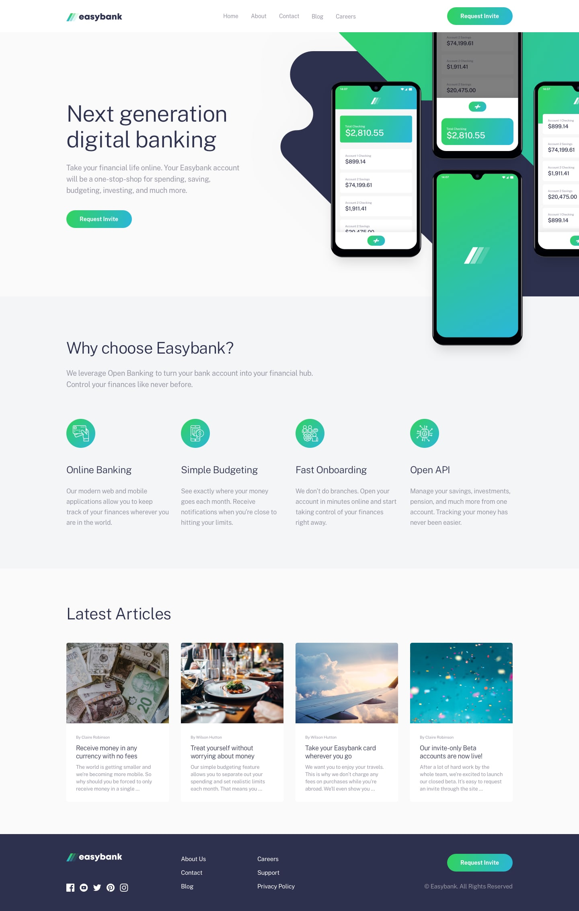

# Frontend Mentor - Easybank landing page solution

This is a solution to the [Easybank landing page challenge on Frontend Mentor](https://www.frontendmentor.io/challenges/easybank-landing-page-WaUhkoDN). The design challenge 

## Table of contents

- [Frontend Mentor - Easybank landing page solution](#frontend-mentor---easybank-landing-page-solution)
  - [Table of contents](#table-of-contents)
  - [Overview](#overview)
    - [The challenge](#the-challenge)
    - [Screenshot](#screenshot)
    - [Links](#links)
  - [My process](#my-process)
    - [Built with](#built-with)
    - [What I learned](#what-i-learned)
  - [Author](#author)

**Note: Delete this note and update the table of contents based on what sections you keep.**

## Overview

### The challenge

Users should be able to:

- View the optimal layout for the site depending on their device's screen size
- See hover states for all interactive elements on the page

### Screenshot

### Links

- Solution URL: [Solution Link](https://www.frontendmentor.io/solutions/easy-banking-landing-site-CIVt4OMyf5)
- Live Site URL: [Live Site](https://easybank-landing-pi.vercel.app/)

## My process

Build it as a purely static site and add seo for visibility.

### Built with

- Astro
- Atsro React for interactivity
- Tailwind CSS
- Astro SEO

### What I learned

It was my first time using Astro for a project and completely loved how easy it was to get up and running.

## Author

- Website - [Rioba Ian](https://www.riobaian.dev)
- Frontend Mentor - [@Rioba-Ian](https://www.frontendmentor.io/profile/Rioba-Ian)
- Twitter - [@rioba_riri](https://www.twitter.com/rioba_riri)
